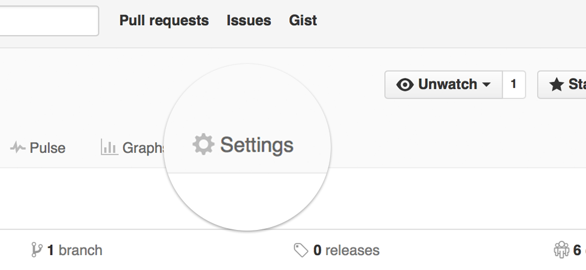
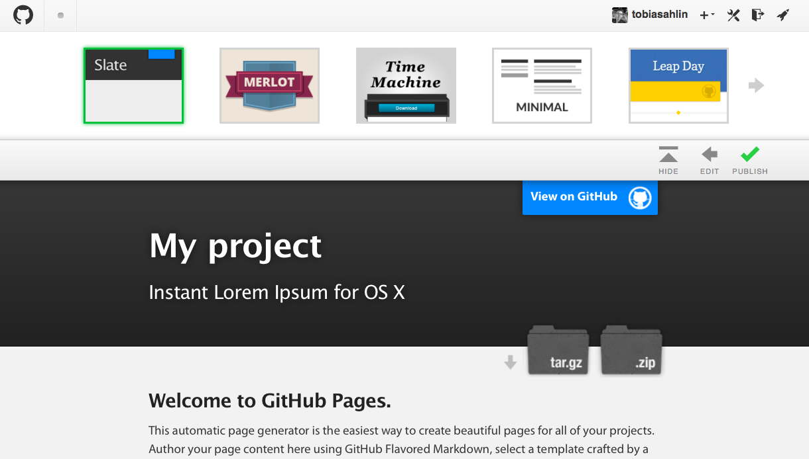

# 附錄 - 如何創造專案網頁

## 使用 Github Page 建立網頁

還記得上次我們用 Github 作為網頁空間，儲存我們的程式專案嗎？
1. 點擊專案頁面的 “setting” 按鈕

2. 點下 “Launch automatic page generator” 按鈕

3. 先不做修改，直接點選 “Continue to Layouts”

4. 選擇版型後，點選 “Publish” 按鈕

5. 接著你就會看到你的網頁出現在 ` http://<帳號名稱>.github.io/<repo名稱> ` 了
