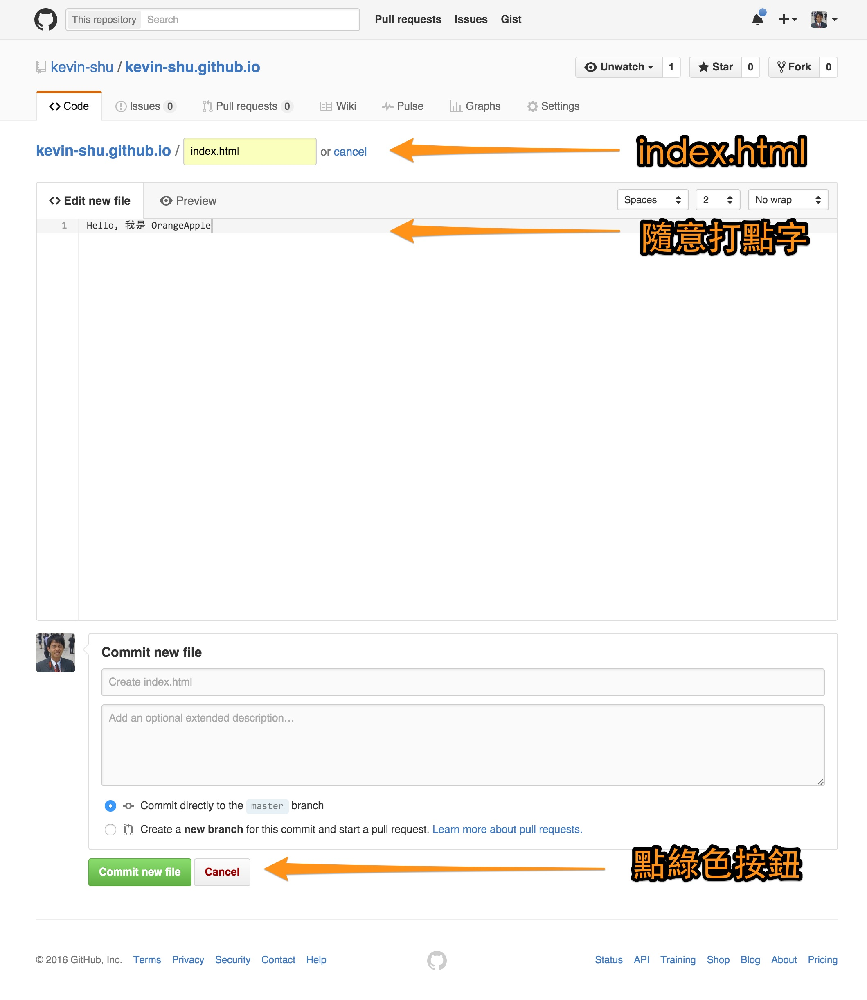

# 前置作業

在開始之前，我們得來複習一下 Github 的使用

## 1. 登入 Github

日後的課堂操作請務必使用 Google Chrome

* Github: https://github.com

## 2. 建立新專案 (Repo)

建立新專案
(教學: https://goo.gl/74ycGE)

1. 專案名稱請取做 `<帳號名稱>.github.io`
(例如：_orangeapple.github.io_)
* 勾選“產生README”的選項
* 確認 (Create repository)

* 在專案頁面點選“new file”
* 將檔案命名為 “index.html”
* Type some words.
* Click the "Commit new file" button (The green one)

* And now you should see these apear at the url: `http://<帳號名稱>.github.io`
(Ex. http://kevin-shu.github.io)

> ### 小提示:
> 如果沒有看到，請確認是否已經在 Github 上進行 Email 認證了

