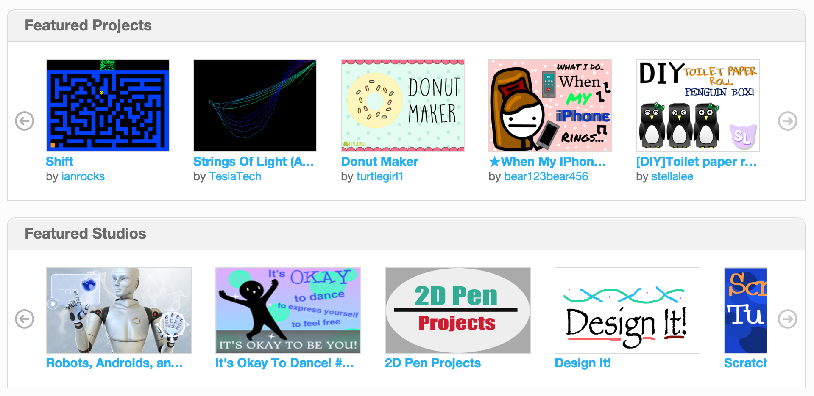

# 自訂網頁外觀

## 用 css 定義外觀
1. 在 css 資料夾下創造 style.css 檔案

(輸入 css 後按下 “/” 即可)
2. 還記得之前學過的 "選擇器" (selector) 嗎？
試著為特定的標籤設定不同的外觀吧！

> ###參考資料：
> * W3C school: http://www.w3schools.com/css/
> * CSS Dinner: http://flukeout.github.io/

## 挑戰時間
請試著為你的作品設定特別的外觀，做成像是 Scratch 的特色專案展示一樣，並且能夠連到你的專案所在網址。

