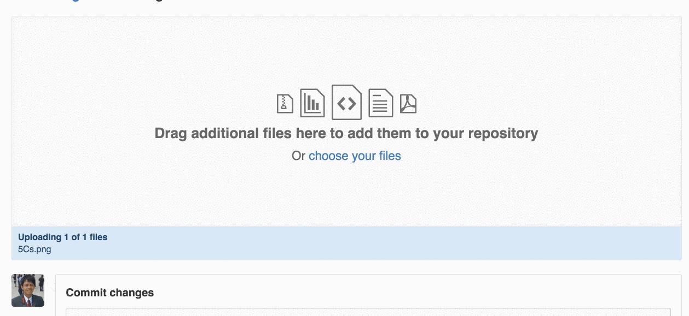

# 嵌入圖片

1. 建立 `images` 資料夾
(隨便新增一個文字檔案，例如 img.txt)
2. 在 images 資料夾中點選 “upload files” 上傳一張圖片

3. 上傳想上傳的圖片，點選網頁下方的綠色按鈕送出

使用 `` 標籤在網頁中嵌入剛剛上傳的圖片吧！
(http://www.w3schools.com/tags/tag_img.asp)

> ### 請注意！
> 上傳時請等待檔案完全上傳完成 (從藍變白)，送出時才會成功！
> 

