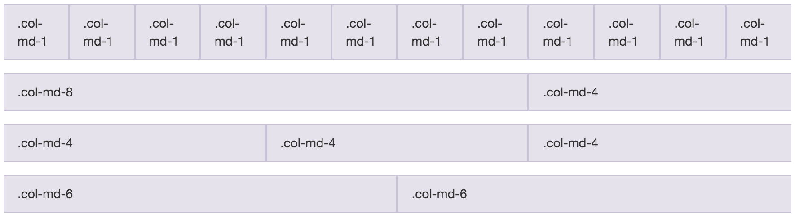

# 認識 Bootstrap 格線系統 (Grid System)

你們是否常常會看到一些網頁，像是 Facebook、Yahoo 都有位在左右的側欄，好奇是怎麼做出來的呢？使用 Bootstrap 就能輕鬆做到喔！

## Bootstrap 佈局結構

在 Bootstrap 的格線系統中，一行最多切割成 12格。
只要使用 Bootstrap 提供的 `col-md-*` 樣式，我們就可以將欄位照比例切割出來。



而為了正確顯示 Bootstrap 的格線佈局，我們必須遵從 Bootstrap 的設計，使用以下的結構

```html
<div class="container"> <!-- container 在最外層 -->
  <div class="row">     <!-- row 在中間 -->
    <div class="col-md-4"></div> <!-- 這欄佔4格寬 -->
    <div class="col-md-6"></div> <!-- 這欄佔6格寬 -->
    <div class="col-md-2"></div> <!-- 這欄佔2格寬 -->
  </div>
</div>
```

## 實作時間
請試著“切”出一塊側欄，用來放上你的大頭照，並在大頭照下放上基本介紹，以及喜歡或常去的網站連結。


