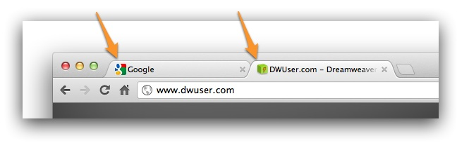
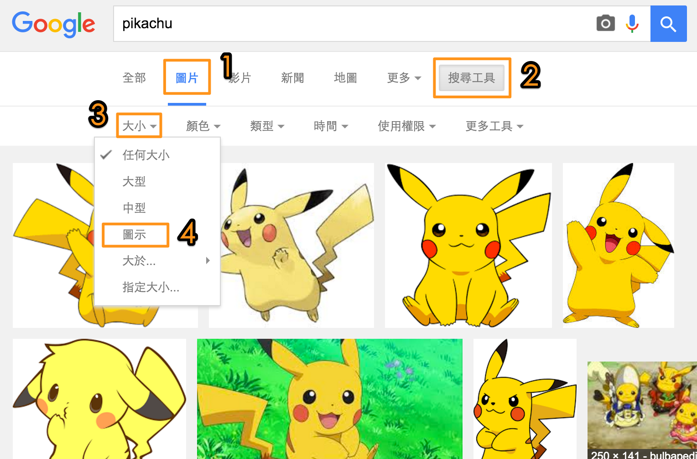

# 為你的網站加上 favicon

你在上網時，應該總是能在瀏覽器的頁籤上看到一個小小的圖示，那就是favicon了。



## 在網站上加入 favicon

要在網站上加入 favicon 非常簡單，只要在`<head>`中加入這行：
```html
<link rel="shortcut icon" href="https://orangeapple.co/favicon.png" type="image/x-icon" />
```
請注意，`href`放的是你的favicon的位置喔！
現在試著加入這行，看看有什麼改變吧！

## 搜尋合適大小的 favicon

首先在 google 搜尋特定主題，接著：

1. 切換為圖片結果
2. 點選搜尋工具
3. 選擇大小
4. 選擇“圖示”大小。若你希望更精準的話，可以選擇“指定大小”，設定為“16X16”或“32X32”



接著你就會找到很多小圖示了！
請記得使用正方形的圖片哦。

## 自己畫 Favicon
你也可以在這個網站自己畫一個 favicon:
http://www.favicon.cc/
