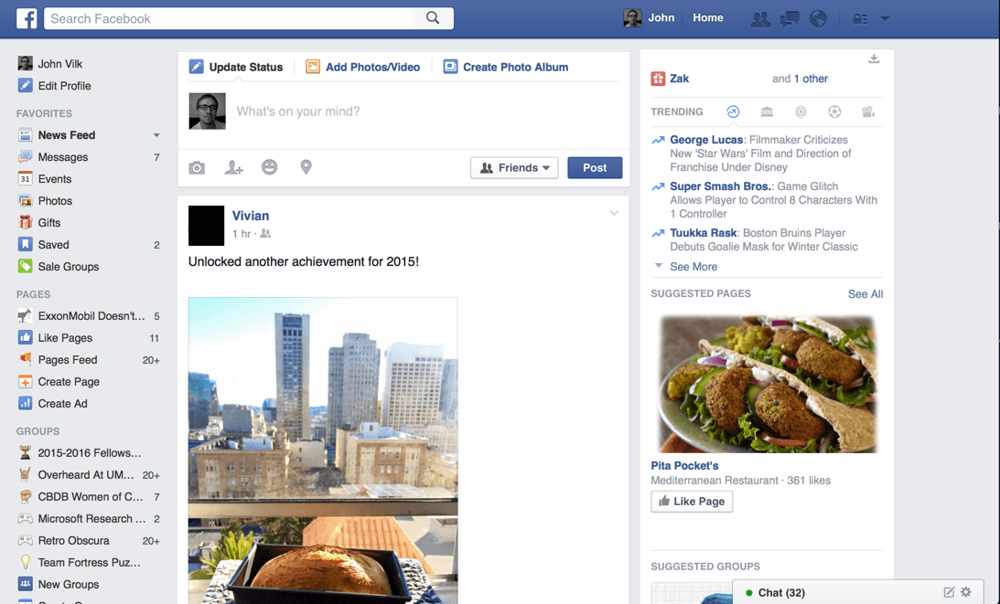

# 導覽列 Navbar

Bootstrap 已經幫我們設計好一些元件，我們只要照他的規範寫出 html 程式碼，並且套入預設的 Class，就可以很快的產出一些網頁常見的元件，例如導覽列。

## 什麼是導覽列？


> 這個畫面你應該很常看到，最上面藍色的那條就是導覽列了

導覽列的作用在於能讓常用的一些連接或功能，出現在最顯眼的頂端。

## Navbar 元件

Bootstrap 也提供了導覽列元件，只要將以下程式碼貼上後即可看到導覽列
```html
<nav class="navbar navbar-default navbar-fixed-top" role="navigation">
  <div class="container">
    <!-- 在這裡加上你的網站名稱或 LOGO 吧！ -->
  </div>
</nav>
```

<br>

### 但是！
這時你應該會發現網頁有一部分被蓋到了，原來 Bootstrap 提供了多種的導覽列樣式，而上面的程式碼套用的是 `navbar-fixed-top` 樣式(Class)，這種導覽列的特性是 ***永遠顯示在最上方*** (跟 facebook 一樣)。

所以為了不讓好好的網頁內容被蓋住，我們會希望網頁的上方有一塊的“留白”。
那麼，要怎麼讓一個區塊留白呢？

這裡我們使用 css 的 padding 特性 (還記得他嗎？)：

```css
/* 讓body的最上方向內縮70px */
body {
    padding-top: 70px;
}
```

## 實作時間
請在網頁中加入導覽列，並參考 bootstrap 的 [教學網頁](http://getbootstrap.com/components/#navbar)，放上網站名稱，以及一些連結、按鈕。

