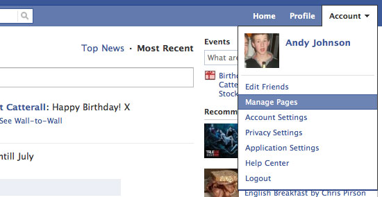

# 下拉式選單
很多網頁的導覽列上都有連結以及下拉選單，而 Bootstrap 也有提供「下拉選單」的元件。




## 加入連結

我們先試著在 `<nav>` 中加入以下程式碼：

```html
<ul class="nav navbar-nav navbar-right">
    <li><a href="#">連結</a></li>
</ul>
```

這時你應該會看到導覽列右方出現了一個連結按鈕，這樣就完成導覽列的控制區塊，並且加上一個連結了！

> ### 小提示：
> 試著更改連結的位置，連到別的網頁去吧！


## 加入下拉式選單

現在我們已經在導覽列加入一個控制區塊了，現在我們要在裡面再加上一個 下拉式選單。
現在在剛剛的 `<ul>` 中加入以下程式碼 (在`<li><a href="#">連結</a></li>`的下方或上方)：

```html
<li class="dropdown">
    <a href="#" class="dropdown-toggle" data-toggle="dropdown" role="button" aria-haspopup="true" aria-expanded="false">Dropdown <span class="caret"></span></a>
    <ul class="dropdown-menu">
        <li><a href="#">Action</a></li>
        <li><a href="#">Another action</a></li>
        <li><a href="#">Something else here</a></li>
        <li role="separator" class="divider"></li>
        <li><a href="#">Separated link</a></li>
    </ul>
</li>
```

> ### 注意：
> 以上程式碼中，class 為 `dropdown-menu` 的區塊就是點下後會出現的下拉列表了，你會注意到：***這個列表是沒有顯示出來的***，那是因為在 bootstrap.css 中將他設定成隱藏的關係。

此時，你會看到我們多了一個按鈕，但是點下後卻沒有任何反應！
原來是因為 Bootstrap 需要依賴 JavaScript 來控制 下拉式選單的出現。而這些 JavaScript 程式碼都是寫在 bootstrap.js 中，必須將這個函式庫引入後，才能使用這些功能。

而 bootstrap.js 又依賴於 jquery.js 這個非常有名的函式庫，才能正常運作，所以我們現在要將兩個函式庫上傳，並在網頁中引入它們：

1. 下載函式庫
  * https://code.jquery.com/jquery-1.12.2.min.js
  * https://maxcdn.bootstrapcdn.com/bootstrap/3.3.6/js/bootstrap.min.js
2. 上傳函式庫到 js 資料夾
3. 在 index.html 的 body 區塊的尾端引入兩個函式庫
```html
<script type="text/javascript" src="函式庫的路徑"></script>
```

> ### 請注意!
> 因為 bootstrap.js 依賴 jquery.js，因此在網頁中必須先引入 jquery，再引入 bootstrap
