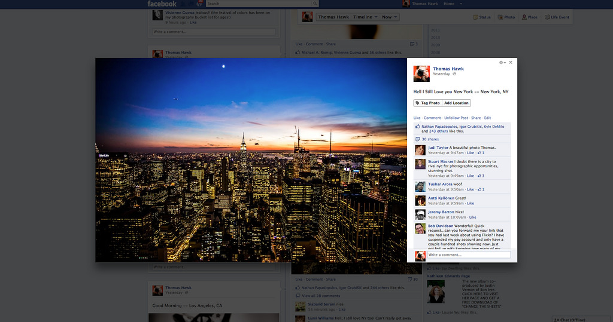
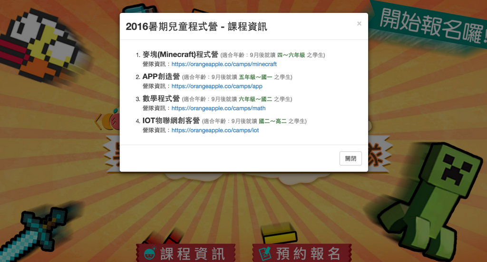

# Modal

之前我們常用 alert, prompt 作為與使用者互動的工具，但是他們只能表現純文字而已，無法用作更豐富的表現、多元的用途，例如請使用者一次輸入2筆以上的資料。因此在網頁設計上常使用的一個介面叫做 “Lightbox” ，很多網站都會使用這樣的介面來呈現資料，Facebook 就大量的使用這種技巧！

而在 Bootstrap 中，這種模式叫做 “Modal”，現在我們來學習如何使用 bootstrap 提供的函式，叫出 modal。

進入這個網頁，點下藍色的按鈕試試看吧：
http://getbootstrap.com/javascript/#live-demo

## 實作時間
參照以下網頁中的介紹，在自己的網頁中加入一個 Modal。而 Modal 的內容可以是 Google 表單、youtube影片，或是自己的程式專案。
http://getbootstrap.com/javascript/#live-demo
