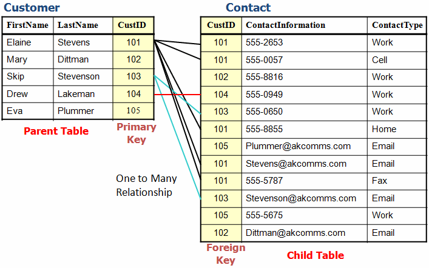

# 認識資料庫 Database - part 1

## 什麼是資料庫 (Database)？
資料庫是一個照特定格式，一筆一筆儲存各種資料的軟體。
經常使用在企業、學校、銀行、政府等機構。

> ###想想看
> 學校在什麼情況下會用到資料庫呢？

## 資料表 (Tables)
但是，一個資料庫中儲存的資料有很多，每筆資料的類型都不同，比較不適合全部放在一起。
舉例來說，一個製造玩具的公司，擁有很多「員工」以及「玩具」的資料，就會分別把兩種資料分別放在不同的資料表裡。

我們用 Google 表單來模擬一下：學校是如何用資料庫來紀錄學生以及家長資料的。
[資料表連結](https://docs.google.com/spreadsheets/d/1ITPMl-C4This8BBk1fOiUQ_ktgnyM6dEZYpnwRMoUdg/edit#gid=0)

## 試試看
如果你是學校的 IT 人員，你會如何設計資料庫的結構，
為每個學生儲存多次考試的成績？

---

>### 補充資料 - 資料的關聯
你可能已經注意到了，資料表中的每一筆資料，都有獨一無二的 id，用來辨識這筆資料的身分，這就叫做 primary key。
而另一個資料表如果想要與另一個資料表的資料產生關係，就要用一個欄位記錄跟他有關的這筆資料的 id，而這個欄位就叫做 foreign id。(可以再仔細觀察一下剛剛的範例資料表)

