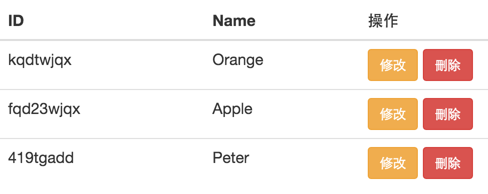

# 刪除學生資料

從資料庫中刪除資料的方法：

```javascript
// 刪除特定 id 的資料
collection.remove({
    _id: "$b28e3b2v4"
});
```

### 實作時間
* 在學生表格的欄位上增加一個按鈕，當點下時會刪除這筆資料。並同時從網頁中刪除。



### 進階挑戰
* 當點下刪除按鈕時，網頁會先問使用者「你確定嗎？」。
當使用者點選「確認」的時候再進行刪除。

> 可使用 [confirm](http://www.w3school.com.cn/jsref/met_win_confirm.asp) 函式實作此功能
